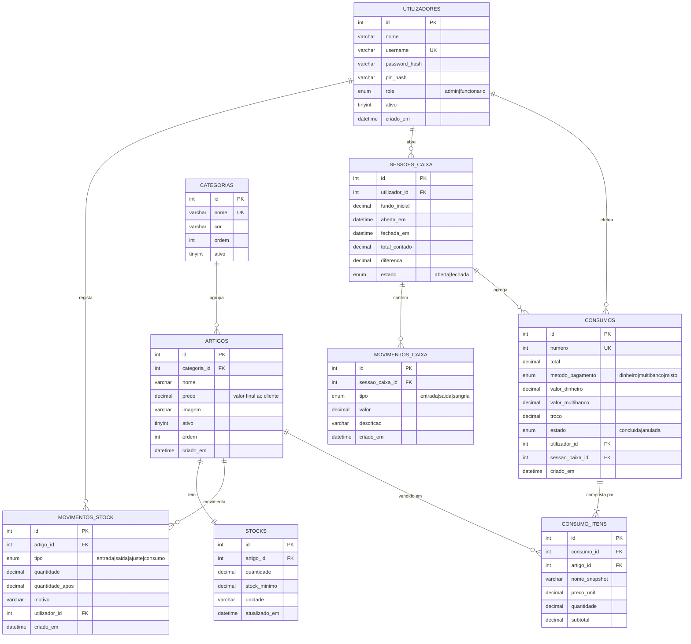

# Bar do Campo — gestão de bar (Movimentos Internos + backoffice)

Aplicação web para gerir o bar de um campo de futebol. Foi pensada para um posto
único atrás do balcão, com **ecrã táctil**: o funcionário toca nos artigos e regista
o que saiu. Fora das horas de jogo, o mesmo sistema serve para repor stock, ver o
que se consumiu e fechar as contas do dia.

> ### Movimentos internos — não há dinheiro no ecrã
> O ecrã de balcão **não é uma venda com dinheiro**: é o **registo de movimentos
> internos** de artigos consumidos. Não há seleção de método de pagamento, valor
> recebido nem troco. O funcionário escolhe os artigos e toca em **Registar**; o
> total continua a ser calculado e gravado.
>
> Consequência importante: **os movimentos internos contam para o dinheiro
> esperado da caixa, pelo seu `total`.** São gravados com
> `metodo_pagamento = 'interno'`, `valor_dinheiro = 0` e `troco = 0`, mas o fecho
> soma-os à parte (agregado `interno`), não via `valor_dinheiro - troco`.
> Ver **[Fecho de caixa: como se calcula o esperado](#fecho-de-caixa-como-se-calcula-o-esperado)**.
>
> Os nomes técnicos acompanham a linguagem da interface: tabelas
> `consumos`/`consumo_itens`, rotas `/api/consumos` e `/admin/consumos`.

> ### Sem IVA
> **Não existe IVA nesta aplicação.** O preço do artigo é o valor final. Não há
> coluna, campo nem cálculo de IVA em nenhuma parte do sistema (base de dados,
> serviços, comprovativo ou relatórios).

## Stack

- Node.js 18+ / Express 5
- MariaDB 11 (driver `mariadb` com connection pool)
- EJS (renderização no servidor) + Bootstrap 5.3.3 + Bootstrap Icons 1.11.3 (CDN)
- express-session + bcryptjs, multer, express-validator, dotenv
- Testes com `node:test` + supertest

---

## Funcionalidades

**GIM — Movimentos Internos (registo rápido)**
- Grelha táctil de artigos com filtro por categoria e pesquisa por nome.
- Carrinho com quantidades, total ao vivo e limpeza rápida.
- Confirmação num só passo: **Registar** → resumo → **CONFIRMAR**. Sem métodos de
  pagamento, sem teclado de valor recebido e sem troco.
- Comprovativo de movimento interno imprimível (80 mm ou 58 mm).
- **Alertas de stock baixo no ecrã**: aviso no próprio artigo, contador de artigos
  em falta e aviso ao concluir — sempre sem bloquear o registo.
- Não bloqueia sem caixa aberta: o registo funciona sempre, mas o ecrã avisa que os
  movimentos ficarão fora do fecho.

**Artigos e categorias**
- Criação/edição de categorias com cor e ordem de apresentação.
- Criação/edição de artigos com preço, **preço de custo**, categoria, ordem, imagem e
  stock inicial. Os campos de dinheiro aceitam o formato português (`0,40`) e o
  formato do servidor (`0.40`).
- A listagem mostra custo, preço e **margem** (€ e %). A margem é `preço − custo`,
  com a percentagem calculada sobre o **preço de venda**; sem preço de venda não há
  base de cálculo e mostra-se `—` (nunca `NaN` nem `Infinity`).
- Artigos e categorias já usados são desativados (nunca apagados) para preservar o histórico.

**Stocks**
- Quantidade atual, stock mínimo e unidade por artigo.
- Movimentos manuais de entrada, saída e ajuste de inventário.
- Alertas de stock baixo e histórico completo e filtrável de movimentos.

**Caixa (turnos)**
- Abertura de caixa com fundo inicial.
- Movimentos de entrada, saída e sangria durante o turno.
- Fecho com valor contado e cálculo automático da diferença face ao esperado.
- **Os movimentos internos contam para o esperado**, pelo seu total (fundo 20 +
  movimentos 5 = esperado 25). Movimentos anulados não contam.
- Resumo com as parcelas do esperado discriminadas, para o fecho ser auditável.
- Aviso destacado quando existem movimentos registados **sem caixa aberta** (ficaram
  fora de qualquer fecho).
- Histórico de sessões e detalhe de cada uma.

**Relatórios**
- Dashboard com o resumo de hoje, últimos 7 dias, top 5 artigos e alertas de stock.
- Relatórios por período: totais consumidos, movimentos por dia, top de artigos e
  consumo por categoria.
- **Rentabilidade do período**: total consumido a preço de venda, custo dos artigos
  consumidos, margem em € e em %, margem por categoria e **margem por artigo**
  (as margens negativas aparecem a vermelho).
- O custo usado nos relatórios é o que estava registado no artigo **no momento do
  consumo** (`consumo_itens.custo_unit`), tal como acontece com o preço. Alterar hoje
  o preço de custo de um artigo **não** altera a margem já apurada nos meses anteriores.

**Backoffice autenticado**
- Login por utilizador/password ou entrada rápida por PIN de 4 dígitos.
- Dois perfis: `admin` (GIM + caixa + gestão) e `funcionario` (só GIM).
- Listagem de movimentos com filtros e anulação com reposição de stock. Os
  pagamentos antigos (`dinheiro`/`multibanco`/`misto`) continuam visíveis no
  histórico.

---

## Requisitos

| Componente | Versão |
| --- | --- |
| Node.js | 18 ou superior (declarado em `engines` no [package.json](package.json)) |
| MariaDB | 11 (o schema usa InnoDB e `utf8mb4`) |
| Navegador | Qualquer navegador moderno. O Bootstrap e os ícones vêm de CDN, pelo que o posto precisa de Internet para carregar os estilos |

---

## Instalação passo a passo

### 1. Instalar dependências

```bash
npm install
```

### 2. Criar a base de dados

O script `npm run db:schema` já cria a base de dados se ela não existir, usando as
credenciais do `.env`. Se preferir criá-la à mão (por exemplo, para usar um
utilizador com menos privilégios), o comando SQL é:

```sql
CREATE DATABASE IF NOT EXISTS bar_campo
  CHARACTER SET utf8mb4 COLLATE utf8mb4_unicode_ci;
```

Opcionalmente, criar um utilizador dedicado:

```sql
CREATE USER 'bar_app'@'localhost' IDENTIFIED BY 'a-sua-password';
GRANT ALL PRIVILEGES ON bar_campo.* TO 'bar_app'@'localhost';
FLUSH PRIVILEGES;
```

> Se usar um utilizador sem permissão de `CREATE DATABASE`, tem de criar a base de
> dados manualmente antes de correr `npm run db:schema`.

### 3. Configurar o `.env`

```bash
cp .env.example .env
```

Preencher o ficheiro `.env`. Variáveis lidas por [`src/config/env.js`](src/config/env.js):

| Variável | O que faz | Default | Exemplo |
| --- | --- | --- | --- |
| `PORT` | Porta HTTP onde a aplicação fica à escuta. | `3000` | `3000` |
| `NODE_ENV` | Modo de execução. Em `production` os erros deixam de mostrar o stack trace e os ficheiros estáticos passam a ter cache de 7 dias. | `development` | `production` |
| `DB_HOST` | Endereço do servidor MariaDB. | `localhost` | `localhost` |
| `DB_PORT` | Porta do MariaDB. | `3306` | `3306` |
| `DB_USER` | Utilizador da base de dados. | `root` | `bar_app` |
| `DB_PASSWORD` | Password desse utilizador. | *(vazio)* | *(o seu segredo — nunca partilhar nem versionar)* |
| `DB_NAME` | Nome da base de dados. | `bar_campo` | `bar_campo` |
| `DB_CONNECTION_LIMIT` | Número máximo de ligações do pool. Num posto único, 10 é folgado. | `10` | `10` |
| `SESSION_SECRET` | Segredo que assina o cookie de sessão. **Obrigatório em produção** — a aplicação recusa arrancar com `NODE_ENV=production` sem ele. | `dev-secret-inseguro-mudar` | *(valor aleatório de 64 caracteres, ver abaixo)* |
| `SESSION_COOKIE_SECURE` | `true` faz o cookie de sessão viajar apenas em HTTPS. Deixar `false` em HTTP local, caso contrário ninguém consegue iniciar sessão. | `false` | `false` |
| `UPLOAD_MAX_BYTES` | Tamanho máximo, em bytes, das imagens de artigo. | `2097152` (2 MB) | `2097152` |

Variáveis opcionais lidas apenas por [`db/seed.js`](db/seed.js), úteis para não usar as
credenciais por omissão: `SEED_ADMIN_USERNAME`, `SEED_ADMIN_PASSWORD`, `SEED_ADMIN_PIN`.

**Gerar um `SESSION_SECRET` forte** (qualquer um destes comandos serve; copiar o
resultado para o `.env`):

```bash
openssl rand -hex 32
# ou, sem openssl:
node -e "console.log(require('crypto').randomBytes(32).toString('hex'))"
```

### 4. Aplicar o schema (e as migrações)

```bash
npm run db:schema      # executa node db/apply-schema.js
```

Cria a base de dados (se ainda não existir), aplica [`db/schema.sql`](db/schema.sql)
e, logo a seguir, [`db/migrations.sql`](db/migrations.sql).
É seguro repetir: todas as tabelas usam `CREATE TABLE IF NOT EXISTS` e as
migrações são idempotentes.

> **Migração obrigatória em bases de dados já existentes**
> O `schema.sql` só cria tabelas em falta (`CREATE TABLE IF NOT EXISTS`), por isso
> **não altera** uma tabela `consumos` que já exista. Para os movimentos internos foi
> acrescentado o valor `interno` ao ENUM `metodo_pagamento`, aplicado por
> `db/migrations.sql`:
>
> ```sql
> ALTER TABLE consumos
>   MODIFY COLUMN metodo_pagamento
>     ENUM('dinheiro','multibanco','misto','interno') NOT NULL DEFAULT 'interno';
> ```
>
> Basta correr `npm run db:schema` numa instalação existente. Para confirmar:
>
> ```bash
> docker exec bar_campo_db mariadb -u"$DB_USER" -p"$DB_PASSWORD" "$DB_NAME" \
>   -e "SHOW COLUMNS FROM consumos LIKE 'metodo_pagamento';"
> ```
>
> Sem esta migração, qualquer registo de movimento interno falha com
> *Data truncated for column 'metodo_pagamento'*.

### 5. Correr o seed

```bash
npm run db:seed        # executa node db/seed.js
```

Cria os dois utilizadores (responsável `admin` e funcionário `bar`), 6 categorias e 24
artigos de exemplo com stock inicial. É idempotente: se já existirem, não duplica nada.

> Atalho para os passos 4 e 5 de uma vez: `npm run db:setup`.

### 6. Arrancar

```bash
npm start              # node src/server.js
npm run dev            # node --watch src/server.js (reinicia ao guardar ficheiros)
```

A aplicação fica disponível em `http://localhost:3000` (ou na porta definida em `PORT`).

---

## Perfis e permissões

A aplicação tem **dois perfis**. A regra é simples: **só o responsável (`admin`) mexe em
dinheiro e em gestão; o funcionário só regista movimentos internos.**

| Área | `admin` | `funcionario` |
| --- | :---: | :---: |
| GIM — ecrã de Movimentos Internos (`/gim`) | ✅ | ✅ |
| GIM — catálogo e registo (`/api/gim/artigos`, `POST /api/consumos`) | ✅ | ✅ |
| Terminar sessão (`POST /logout`) | ✅ | ✅ |
| Caixa — abrir, sangrias, fechar, histórico (`/caixa/*`) | ✅ | ❌ 403 |
| Backoffice — dashboard e relatórios (`/admin`, `/admin/relatorios`) | ✅ | ❌ 403 |
| Backoffice — artigos, categorias, stocks, movimentos (`/admin/*`) | ✅ | ❌ 403 |
| Backoffice — movimentos internos e anulações (`/admin/consumos`) | ✅ | ❌ 403 |

Como se comporta na prática:

- **Depois do login**, cada perfil vai para a sua área: o `admin` para `/admin`, o
  funcionário **sempre** para `/gim`. Se um funcionário tentar abrir `/caixa` sem sessão,
  é levado ao login e, depois de entrar, vai para o GIM — nunca para um ecrã de 403.
- **Sem sessão** nenhuma, qualquer rota protegida **redireciona para `/login`** (não dá 403).
  Nas rotas `/api/*` responde `401` em JSON.
- **Com sessão de funcionário** numa área de admin, a resposta é **`403`** (página de erro
  com botão de volta ao GIM) ou `403` em JSON nas rotas `/api/*`.
- **O menu esconde** o que o perfil não pode abrir: o funcionário só vê *Movimentos Internos*
  e *Sair*, e no GIM não lhe aparecem os atalhos de *Caixa* e *Gestão*.

> **Esconder na interface não é segurança.** Os links escondidos são só conforto; quem
> garante a separação é o servidor (`requireAdmin` em `src/routes/admin.routes.js` e
> `src/routes/caixa.routes.js`). Escrever o endereço à mão dá `403` na mesma.

### Fluxo operacional de um dia de jogo

1. **O responsável abre a caixa** no início do dia: entra como `admin`, vai a **Caixa** e
   regista o fundo inicial. É importante fazê-lo **antes** do serviço — os movimentos
   registados com a caixa fechada ficam fora do fecho.
2. **O funcionário regista os movimentos** no GIM durante todo o dia. Não precisa de saber
   nada de caixa nem de gestão — toca nos artigos e carrega em **Registar**. Havendo
   sessão de caixa aberta, o movimento fica-lhe associado e **soma ao valor esperado**.
3. **O responsável faz as sangrias** quando houver dinheiro físico em gaveta, sempre a
   partir do seu perfil.
4. **O responsável fecha a caixa** no fim do dia: conta o dinheiro físico, introduz o valor
   contado e o sistema mostra a diferença face ao esperado — que **inclui** o total dos
   movimentos internos da sessão.

O ecrã de Movimentos Internos **não exige caixa aberta** (o registo nunca é bloqueado), mas
**avisa** quando não há: ao funcionário pede para avisar o responsável, ao administrador
dá atalho para abrir a caixa. Sem sessão, os movimentos ficam com `sessao_caixa_id = NULL`
e são sinalizados no ecrã `/caixa`.

---

## Credenciais iniciais

O seed cria **dois** utilizadores, um por perfil:

| Campo | Responsável | Funcionário |
| --- | --- | --- |
| Utilizador | `admin` | `bar` |
| Password | `admin123` | `bar123` |
| PIN | `1234` | `4321` |
| Perfil | `admin` | `funcionario` |
| Acesso | Tudo: GIM, caixa e backoffice | Apenas o GIM |

> ## ⚠️ Alterar as passwords e os PINs de **ambos** antes de usar a sério
> Estas credenciais são **públicas** — estão neste README e no código do seed. Qualquer
> pessoa com acesso à rede do posto consegue entrar com elas. Isto vale tanto para o
> `admin` como para o `bar`: uma conta de funcionário comprometida dá acesso a registar
> consumos em nome do bar.
>
> Antes de pôr o sistema a funcionar no bar, defina credenciais próprias correndo o seed
> com valores seus **antes do primeiro arranque**:
>
> ```bash
> SEED_ADMIN_USERNAME="o.seu.utilizador" \
> SEED_ADMIN_PASSWORD="uma-password-longa-e-unica" \
> SEED_ADMIN_PIN="0000" \
> SEED_BAR_USERNAME="o.utilizador.do.balcao" \
> SEED_BAR_PASSWORD="outra-password-longa-e-unica" \
> SEED_BAR_PIN="0001" \
> npm run db:seed
> ```
>
> Os dois PINs têm de ser **diferentes** entre si: a entrada rápida procura o utilizador
> pelo PIN, sem pedir o nome.
>
> Se já correu o seed com os valores por omissão, os utilizadores `admin` e `bar` já existem
> e o comando acima cria utilizadores adicionais; nesse caso, desative ou remova os
> originais diretamente na base de dados.
>
> **Nota:** esta versão ainda não tem ecrã de gestão de utilizadores nem de mudança de
> password na aplicação. A gestão de contas — criar, desativar, mudar password ou trocar o
> perfil de alguém — faz-se pelo seed ou diretamente na base de dados.

---

## Utilização diária

Esta secção é para quem está ao balcão. Não é preciso perceber nada de informática.

Cada passo indica **quem** o faz. Os passos marcados *(responsável)* só funcionam com o
perfil `admin`; ao funcionário nem sequer aparecem no menu.

### 1. Entrar na aplicação *(ambos)*

Abrir o navegador em `http://localhost:3000` (ou no endereço do posto). Há duas formas
de entrar:

- **Utilizador e password** — escrever o utilizador e a password e carregar em entrar.
- **PIN** — escrever os 4 dígitos do PIN no campo "Entrada rápida por PIN". É a forma
  mais rápida no ecrã táctil.

### 2. Abrir a caixa (início do dia) *(responsável)*

1. No menu de cima, tocar em **Caixa**.
2. Em "Abrir caixa", introduzir o **fundo inicial**: o dinheiro em notas e moedas com que
   a caixa começa o dia (para dar trocos). Pode usar o teclado numérico do ecrã.
3. Tocar em **abrir**.

A partir daqui, os movimentos internos registados no GIM ficam associados a esta sessão de
caixa e **contam para o dinheiro esperado** no fecho.

> Só pode existir **uma caixa aberta de cada vez**. Se tentar abrir outra, a aplicação
> avisa que já existe uma sessão aberta.
>
> Os movimentos internos **não ficam bloqueados** se se esquecer de abrir a caixa — o
> registo funciona sempre. Mas ficam **sem sessão associada** e, por isso, **fora de
> qualquer fecho de caixa**. Ver
> [Movimentos registados sem caixa aberta](#movimentos-registados-sem-caixa-aberta).

### 3. Registar um movimento interno no GIM *(ambos)*

1. Tocar em **Movimentos Internos** no menu (ou ir a `/gim`).
2. Tocar nos artigos consumidos. Cada toque acrescenta uma unidade ao carrinho, à direita.
   Pode filtrar por categoria ou pesquisar pelo nome.
3. Ajustar quantidades no carrinho, se necessário.
4. Tocar em **Registar**.
5. Confirmar no resumo que aparece (artigos, quantidades e total) e tocar em **CONFIRMAR**.
6. O movimento fica registado, o stock é descontado e aparece o número do movimento e o
   total. **Não há método de pagamento, valor recebido nem troco.**
7. Se quiser, tocar em **Comprovativo** para abrir o comprovativo imprimível.
8. Tocar em **NOVO MOVIMENTO** (ou `Esc`) para voltar ao ecrã limpo.

Se algum artigo ficar com stock negativo, o movimento **é registado na mesma** e aparece um
aviso — nunca se perde um registo por causa do inventário.

#### Avisar o responsável quando um artigo está a acabar

O GIM assinala sozinho os artigos que estão no ou abaixo do **stock mínimo** definido no
backoffice:

- **No artigo**, um sinal de aviso com a quantidade que resta: **âmbar** quando está a
  acabar (`quantidade <= mínimo`) e **vermelho** quando está esgotado ou negativo
  (`quantidade <= 0`).
- **No topo do ecrã**, um botão `⚠ N artigos em falta` que só aparece quando há artigos
  em falta. Ao tocar, abre uma lista com nome, quantidade atual, mínimo e unidade,
  ordenada pelos mais críticos, com a indicação **"Avise o responsável para repor estes
  artigos"**.
- **Ao concluir um movimento**, se algum artigo ficou (ou já estava) abaixo do
  mínimo, aparece um aviso de canto. O ecrã fica logo pronto para o registo seguinte.

O artigo **continua sempre a poder ser registado**, mesmo esgotado ou com stock negativo:
num bar de campo o registo nunca pode parar por causa de um inventário desatualizado. O
funcionário não tem acesso à gestão de stocks — só avisa o responsável, que repõe em
`/admin/stocks`.

### 4. Fazer uma sangria (retirar dinheiro da caixa) *(responsável)*

Uma sangria é retirar dinheiro da caixa a meio do turno (por exemplo, para levar ao cofre
por segurança).

1. Ir a **Caixa**.
2. Em "Registar movimento", escolher o tipo **Sangria**.
3. Introduzir o valor retirado e uma descrição (ex.: "levantamento para o cofre").
4. Confirmar.

No mesmo sítio pode registar **entradas** (dinheiro que entra, ex.: reforço de trocos) e
**saídas** (pagamentos feitos pela caixa, ex.: compra de gelo). Todos estes movimentos
entram automaticamente no cálculo do fecho.

### 5. Fechar a caixa (fim do dia) *(responsável)*

1. Ir a **Caixa**.
2. Contar fisicamente todo o dinheiro que está na gaveta.
3. Em "Fechar caixa", introduzir o **valor contado**.
4. Confirmar.

A aplicação mostra a diferença entre o contado e o esperado:

#### Fecho de caixa: como se calcula o esperado

```
esperado = fundo inicial
         + total dos movimentos internos da sessão
         + dinheiro recebido em vendas antigas (já descontado o troco dado)
         + entradas
         − saídas
         − sangrias
```

Exemplo (o caso mais comum): abre a caixa com **20,00 €** de fundo, o dia corre com
movimentos internos que somam **5,00 €** → o esperado no fecho é **25,00 €**.

O ecrã da caixa mostra estas parcelas uma a uma, para o fecho poder ser conferido a
olho:

```
Fundo inicial            20,00 €
Movimentos internos     + 5,00 €
Entradas                + 0,00 €
Saídas / sangrias       − 0,00 €
─────────────────────────────────
Dinheiro esperado        25,00 €
```

Regras que decorrem daqui:

- **Movimentos anulados não contam.** Só entram os registos com `estado = 'concluida'`.
  Anular um movimento retira-o imediatamente do esperado (e repõe o stock).
- **Multibanco fica de fora.** O que foi cobrado por cartão em vendas antigas não é
  dinheiro físico na gaveta; aparece identificado à parte no ecrã, fora da conta.
- Diferença a zero significa que bateu certo. Ao introduzir o valor contado, a diferença
  aparece a **verde** (certo), **vermelho** (falta) ou **âmbar** (sobra), e fica gravada
  na sessão para consulta futura em `/caixa/sessao/:id`.

#### Movimentos registados sem caixa aberta

O registo de movimentos **nunca é bloqueado** por não haver caixa aberta: o funcionário
não tem permissão para abrir caixa e não pode ficar parado ao balcão.

Mas, como os movimentos internos contam como dinheiro esperado, um movimento registado
com a caixa fechada fica com `sessao_caixa_id = NULL` e **não é contabilizado em caixa
nenhuma**. Para esse dinheiro não desaparecer das contas em silêncio:

- **No GIM**, quando não há caixa aberta aparece uma faixa de aviso: *"Não há caixa aberta
  — os movimentos ficam fora do fecho."* Ao funcionário pede **avise o responsável**; ao
  administrador dá um atalho **Abrir caixa**.
- **No ecrã `/caixa`** (só do administrador) aparece um aviso destacado com a **contagem**
  e o **total** dos movimentos concluídos sem sessão, explicando que ficaram fora de
  qualquer caixa.

A correção operacional é abrir a caixa **antes** do serviço. Movimentos já gravados sem
sessão mantêm-se assim (não são reatribuídos automaticamente a uma caixa posterior, o que
falsearia o fecho dessa caixa) — o total fica visível no aviso para ser reconciliado à mão.

### 6. Repor stock *(responsável)*

1. Menu **Gestão → Stocks**.
2. Procurar o artigo (pode filtrar por "stock baixo" para ver só os que precisam de reposição).
3. Registar um movimento:
   - **Entrada** — chegou mercadoria: soma à quantidade atual.
   - **Saída** — saiu mercadoria sem passar pelo GIM (quebra, oferta): subtrai.
   - **Ajuste** — contou-se o stock real na prateleira: substitui a quantidade pelo valor
     contado (é um inventário, não uma soma).
4. Escrever um motivo (ex.: "entrega do fornecedor") e confirmar.

No mesmo ecrã pode definir o **stock mínimo** e a **unidade** de cada artigo. Quando a
quantidade chega ao mínimo, o artigo passa a aparecer nos alertas do dashboard.

Todo o histórico fica em **Gestão → Movimentos de stock**, com filtros por artigo, tipo e datas.

### 7. Ver o que mais se consumiu *(responsável)*

- **Dashboard** (menu **Dashboard**) — resumo de hoje, evolução dos últimos 7 dias, os 5
  artigos mais consumidos hoje e os alertas de stock baixo.
- **Gestão → Relatórios** — escolher um intervalo de datas (por omissão, os últimos 30 dias)
  e ver totais, movimentos por dia, os 15 artigos mais consumidos, o consumo por categoria
  e a **rentabilidade** do período (custo, margem em € e em %, e margem por artigo). O
  preço de custo e a margem só aparecem aqui e na gestão de artigos — **nunca no GIM**.
- **Gestão → Movimentos internos** — lista com filtros por data, estado e tipo; permite
  abrir o detalhe de cada movimento e **anular** um movimento errado (o stock é reposto
  automaticamente). Os registos antigos com pagamento (`dinheiro`/`multibanco`/`misto`)
  continuam a mostrar o método; os novos aparecem como *movimento interno*.

---

## Rotas

`público` = não exige sessão · `GIM` = sessão iniciada, admin ou funcionário
(`requireGim`) · `admin` = sessão iniciada **com perfil admin** (`requireAdmin`).

Sem sessão, as rotas protegidas redirecionam para `/login?next=...` (ou `401` em JSON nas
rotas `/api/*`). Com sessão de funcionário numa rota `admin`, a resposta é `403`.

### Operacional e autenticação

| Método | Caminho | Autenticação | Descrição |
| --- | --- | --- | --- |
| GET | `/` | público | Encaminha para a área do perfil: `/admin` (admin), `/gim` (funcionário) ou `/login` (sem sessão). |
| GET | `/health` | público | Liveness. Responde sempre, mesmo sem base de dados. |
| GET | `/ready` | público | Readiness. `200` só se a base de dados responder; `503` caso contrário. |
| GET | `/login` | público | Página de login (utilizador/password e PIN). |
| POST | `/login` | público | Autenticação por utilizador e password. Redireciona conforme o perfil. |
| POST | `/gim/pin` | público | Entrada rápida por PIN de 4 dígitos. Vai sempre para `/gim`. |
| POST | `/logout` | público | Termina a sessão e volta ao login. |

### GIM

| Método | Caminho | Autenticação | Descrição |
| --- | --- | --- | --- |
| GET | `/gim` | GIM | Ecrã de **Movimentos Internos** (táctil). |
| GET | `/api/gim/artigos` | GIM | Catálogo JSON: categorias e artigos ativos com preço, stock e alerta de stock baixo (ver contrato abaixo). |
| POST | `/api/consumos` | GIM | Regista um movimento interno (ver contrato abaixo). |

### Compatibilidade: rotas antigas `/pos`

O ecrã chamava-se **POS** (*Point of Sale*). Como a aplicação deixou de ser um ponto de
venda e passou a ser registo interno, o nome passou a **GIM**. As rotas antigas continuam
a responder com um **redirect `308 Permanent Redirect`**, para não partir os atalhos já
gravados nos tablets do balcão:

| Método | Caminho antigo | Resposta | Destino |
| --- | --- | --- | --- |
| qualquer | `/pos` | `308` | `/gim` |
| qualquer | `/api/pos/artigos` | `308` | `/api/gim/artigos` |
| qualquer | `/pos/pin` | `308` | `/gim/pin` |

> `308` e não `301` de propósito: o `308` **preserva o método e o corpo**, por isso um
> `POST /pos/pin` vindo de uma página de login em cache chega intacto a `/gim/pin`.
> O redirect **não** dá acesso a nada: a autenticação é feita na rota de destino.
>
> Isto é um **andaime de migração temporário**. Assim que todos os atalhos estiverem
> atualizados, o bloco no fim de `src/routes/gim.routes.js` pode ser removido.

> **Não existe rota de talão/comprovativo.** A aplicação é de controlo **interno**
> (stock e registo de consumos) e **não emite qualquer documento para o cliente**.
> Em Portugal, software que emite documentos de consumo tem de ser certificado pela AT
> (assinatura encadeada, ATCUD, QR code, SAF-T) — esta aplicação não é nem quer ser isso.
> A antiga rota `GET /gim/consumo/:id/talao` foi **removida** e responde `404`.

> O caminho `/api/consumos` mantém o nome técnico de propósito: renomear rotas seria uma
> mudança de risco sem benefício para o utilizador. A alteração é apenas de linguagem
> na interface.

### Caixa

Toda a `/caixa` é exclusiva do perfil `admin`: é o responsável que abre, faz sangrias e fecha.

| Método | Caminho | Autenticação | Descrição |
| --- | --- | --- | --- |
| GET | `/caixa` | admin | Estado da caixa aberta, movimentos e histórico de sessões. |
| POST | `/caixa/abrir` | admin | Abre sessão com `fundo_inicial`. |
| POST | `/caixa/movimento` | admin | Regista movimento: `tipo` (`entrada`, `saida` ou `sangria`), `valor`, `descricao`. |
| POST | `/caixa/fechar` | admin | Fecha a sessão com `total_contado`. |
| GET | `/caixa/sessao/:id` | admin | Detalhe de uma sessão de caixa. |

### Backoffice

Todo o `/admin` exige perfil `admin` (`requireAdmin` aplicado no router).

| Método | Caminho | Autenticação | Descrição |
| --- | --- | --- | --- |
| GET | `/admin` | admin | Dashboard. |
| GET | `/admin/relatorios` | admin | Relatórios por período (`?de=AAAA-MM-DD&ate=AAAA-MM-DD`). |
| GET | `/admin/movimentos` | admin | Histórico de movimentos de stock (`?artigo=&tipo=&de=&ate=`). |
| GET | `/admin/categorias` | admin | Lista de categorias. |
| GET | `/admin/categorias/novo` | admin | Formulário de nova categoria. |
| POST | `/admin/categorias` | admin | Cria categoria. |
| GET | `/admin/categorias/:id/editar` | admin | Formulário de edição. |
| POST | `/admin/categorias/:id` | admin | Atualiza categoria. |
| POST | `/admin/categorias/:id/eliminar` | admin | Elimina; se tiver artigos, **desativa**. |
| GET | `/admin/artigos` | admin | Lista de artigos (`?categoria=`). |
| GET | `/admin/artigos/novo` | admin | Formulário de novo artigo. |
| POST | `/admin/artigos` | admin | Cria artigo (aceita upload de imagem no campo `imagem`). |
| GET | `/admin/artigos/:id/editar` | admin | Formulário de edição. |
| POST | `/admin/artigos/:id` | admin | Atualiza artigo (aceita upload de imagem). |
| POST | `/admin/artigos/:id/eliminar` | admin | Elimina; se já tiver movimentos, **desativa**. |
| GET | `/admin/stocks` | admin | Lista de stocks (`?baixo=1&q=termo`). |
| POST | `/admin/stocks/movimento` | admin | Movimento manual: `artigo_id`, `tipo` (`entrada`, `saida` ou `ajuste`), `quantidade`, `motivo`. |
| POST | `/admin/stocks/:artigoId/parametros` | admin | Define `stock_minimo` e `unidade`. |
| GET | `/admin/consumos` | admin | Lista de movimentos internos (`?de=&ate=&estado=&metodo=`). |
| GET | `/admin/consumos/:id` | admin | Detalhe do movimento. |
| POST | `/admin/consumos/:id/anular` | admin | Anula o movimento e repõe o stock. |

---

## Contrato `GET /api/gim/artigos`

Catálogo do GIM. Exige sessão iniciada; sem sessão devolve `401` em JSON.

### Resposta `200`

```json
{
  "categorias": [
    { "id": 1, "nome": "Bebidas", "cor": "#0d6efd", "ordem": 1 }
  ],
  "artigos": [
    {
      "id": 10,
      "categoria_id": 1,
      "nome": "Imperial",
      "preco": 1.20,
      "imagem": "/uploads/imperial.png",
      "stock": 4,
      "unidade": "un",
      "stock_minimo": 30,
      "stock_baixo": true
    }
  ]
}
```

| Campo do artigo | Tipo | Notas |
| --- | --- | --- |
| `id`, `categoria_id` | inteiro | — |
| `nome` | string | — |
| `preco` | número | Valor final: **não há IVA**. |
| `imagem` | string ou `null` | Caminho público (`/uploads/...`) ou `null`. |
| `stock` | número ou `null` | Quantidade atual. `null` se o artigo não tiver linha de stock. |
| `unidade` | string | `un`, `L`, `kg`… Por omissão `un`. |
| `stock_minimo` | número ou `null` | Mínimo configurado no backoffice. `null` se o artigo não tiver linha de stock. |
| `stock_baixo` | booleano | Derivado no servidor: `quantidade <= stock_minimo`. `false` quando `stock` é `null`. |

O `stock_baixo` usa **exatamente a mesma regra** do backoffice (dashboard e
`/admin/stocks`), centralizada em `stockService.isStockBaixo`. O limite é **inclusivo**:
stock igual ao mínimo já conta como baixo. Stock `0` ou negativo é sempre baixo.

O GIM usa este campo para marcar o artigo com um aviso visível (âmbar quando está a
acabar, vermelho quando está esgotado ou negativo) e para o contador de *artigos em
falta*. **O artigo continua sempre vendável** — o alerta nunca desativa o botão.

---

## Contrato `POST /api/consumos`

Regista um **movimento interno**. Exige sessão iniciada; sem sessão devolve `401`.

### Pedido

O ecrã de Movimentos Internos envia apenas os artigos:

```json
{
  "itens": [
    { "artigo_id": 10, "quantidade": 2 },
    { "artigo_id": 5, "quantidade": 1 }
  ]
}
```

| Campo | Tipo | Obrigatório | Notas |
| --- | --- | --- | --- |
| `itens` | array | sim | Pelo menos um elemento. Itens repetidos do mesmo artigo são agregados. |
| `itens[].artigo_id` | inteiro ≥ 1 | sim | ID do artigo. |
| `itens[].quantidade` | número > 0 | sim | Aceita decimais (arredondados a 2 casas). |
| `metodo_pagamento` | `interno`, `dinheiro`, `multibanco` ou `misto` | **não** | Omitido ⇒ `interno`. Os restantes valores continuam aceites por **compatibilidade** (histórico e clientes antigos). |
| `valor_dinheiro` | número ≥ 0 | não | **Ignorado em `interno`** (fica sempre `0`). Nos métodos antigos, valor entregue pelo cliente. |
| `valor_multibanco` | número ≥ 0 | não | **Ignorado em `interno`** (fica sempre `0`). |

Quando o método é `interno` **não há qualquer cálculo de pagamento**: `valor_dinheiro`,
`valor_multibanco` e `troco` ficam a `0` e o registo nunca é recusado por valor insuficiente.

**Os preços nunca vêm do cliente**: o servidor lê sempre o preço atual do artigo na base
de dados. Qualquer preço enviado no pedido é ignorado.

### Resposta `201`

```json
{
  "ok": true,
  "consumo": {
    "id": 12,
    "numero": 12,
    "total": 2.40,
    "metodo_pagamento": "interno",
    "valor_dinheiro": 0,
    "valor_multibanco": 0,
    "troco": 0,
    "avisosStock": [],
    "avisosStockDetalhe": []
  },
  "avisos": [],
  "avisos_stock": []
}
```

O campo **`avisos`** é uma lista de mensagens de texto (o mesmo conteúdo de
`consumo.avisosStock`) e **`avisos_stock`** é a mesma informação estruturada, com o campo
`tipo`. Ambos estão vazios num movimento normal e trazem **no máximo uma entrada por
artigo**, do problema mais grave para o menos grave:

| `tipo` | Quando | Como o GIM o mostra |
| --- | --- | --- |
| `stock_negativo` | O stock do artigo ficou abaixo de zero. | Toast vermelho. |
| `stock_baixo` | O stock ficou (ou já estava) `<= stock_minimo`, sem ser negativo. | Toast âmbar. |

```json
{
  "ok": true,
  "consumo": {
    "id": 13,
    "numero": 13,
    "total": 1.20,
    "metodo_pagamento": "interno",
    "valor_dinheiro": 0,
    "valor_multibanco": 0,
    "troco": 0,
    "avisosStock": ["Imperial ficou com stock negativo (-3)."]
  },
  "avisos": ["Imperial ficou com stock negativo (-3)."],
  "avisos_stock": [
    {
      "tipo": "stock_negativo",
      "mensagem": "Imperial ficou com stock negativo (-3).",
      "artigo_id": 10,
      "artigo": "Imperial",
      "quantidade": -3,
      "stock_minimo": 30,
      "unidade": "un"
    }
  ]
}
```

Estes avisos são **informativos**: o movimento foi criado com sucesso e o funcionário pode
continuar a registar imediatamente. `avisos` mantém-se como lista de strings por
**compatibilidade** com clientes já existentes; clientes novos devem usar `avisos_stock`.

### Erros

| Estado | Quando acontece | Corpo |
| --- | --- | --- |
| `401` | Sem sessão iniciada. | `{ "erro": "Nao autenticado" }` |
| `422` | Payload inválido (falta `itens`, quantidade ≤ 0, método desconhecido…). | `{ "erro": "Dados invalidos", "erros": [ { "campo": "itens", "mensagem": "O movimento tem de ter artigos." } ] }` |
| `400` | Regra de negócio dos **métodos antigos**: valor entregue inferior ao total, ou misto sem uma das componentes. Nunca ocorre em `interno`. | `{ "erro": "Valor entregue inferior ao total do consumo." }` |
| `404` | Um dos `artigo_id` não existe. | `{ "erro": "Artigo 999 nao encontrado." }` |
| `500` | Erro inesperado ou de base de dados (a transação faz rollback). | `{ "erro": "Erro na base de dados." }` |

---

## Modelo de dados

Definição completa em [`db/schema.sql`](db/schema.sql). Todos os valores monetários são
`DECIMAL(10,2)` e todas as tabelas são InnoDB com `utf8mb4`.

### Diagrama



### Tabelas

#### `utilizadores`
Contas de acesso. `password_hash` e `pin_hash` são hashes bcrypt (12 rounds); o PIN é
opcional (`NULL` = sem entrada rápida). `username` é único. `role` distingue `admin` de
`funcionario`: o `admin` acede a tudo, o `funcionario` **apenas ao GIM** (ver
[Perfis e permissões](#perfis-e-permissões)). `ativo = 0` impede o login.

#### `categorias`
Agrupamento dos artigos no GIM. `cor` (hexadecimal `#rrggbb`) e `ordem` controlam a
apresentação. `nome` é único. Categorias com artigos são desativadas em vez de eliminadas.

#### `artigos`
Produtos vendidos. **`preco` é o valor final ao cliente.** `imagem` guarda apenas o nome do
ficheiro em `public/uploads/`. `categoria_id` é opcional e fica a `NULL` se a categoria for
eliminada (`ON DELETE SET NULL`). `ordem` define a posição na grelha do GIM.

#### `stocks`
Uma linha por artigo (`artigo_id` é único). Guarda a `quantidade` atual, o `stock_minimo`
que dispara os alertas e a `unidade` (por omissão `un`). Eliminar o artigo elimina a linha
de stock (`ON DELETE CASCADE`).

#### `movimentos_stock`
Histórico de todas as alterações de stock. `tipo` pode ser `entrada`, `saida`, `ajuste`
(inventário: define o valor absoluto) ou `consumo`. `quantidade_apos` guarda o stock
resultante, o que permite reconstituir o histórico sem recalcular. `utilizador_id` fica a
`NULL` se a conta for eliminada.

#### `sessoes_caixa`
Turnos de caixa. Só deve existir uma com `estado = 'aberta'` — o serviço recusa abrir uma
segunda. No fecho gravam-se `total_contado`, `diferenca` (contado − esperado) e
`fechada_em`. Não é possível eliminar um utilizador com sessões de caixa (`ON DELETE RESTRICT`).

#### `movimentos_caixa`
Entradas, saídas e sangrias registadas durante uma sessão. Eliminar a sessão elimina os
movimentos (`ON DELETE CASCADE`).

#### `consumos`
Cabeçalho do movimento. `numero` é o número sequencial visível no comprovativo (índice
único). `metodo_pagamento` é `ENUM('dinheiro','multibanco','misto','interno')`: os
movimentos internos gravam **`interno`** com `valor_dinheiro`, `valor_multibanco` e `troco`
a `0`; os outros valores só aparecem no histórico anterior à conversão. `estado` passa a
`anulada` quando o movimento é anulado — nunca é apagado. `sessao_caixa_id` liga ao turno e
fica a `NULL` se não houver caixa aberta (o registo funciona sempre).

> **Migração**: em bases de dados criadas antes desta versão é preciso acrescentar
> `interno` ao ENUM — ver [`db/migrations.sql`](db/migrations.sql) e a nota no passo 4 da
> instalação.

#### `consumo_itens`
Linhas do movimento. `nome_snapshot` e `preco_unit` guardam o nome e o preço **no momento
do registo**, para que alterações futuras ao artigo não reescrevam o histórico. `artigo_id`
fica a `NULL` se o artigo for eliminado, mas a linha e o seu `subtotal` mantêm-se.

---

## Decisões de design

**Movimentos internos em vez de venda com dinheiro (e como entram na caixa).**
O balcão passou a registar **consumo interno**, não consumos: escolhem-se os artigos e
carrega-se em *Registar*. Não há método de pagamento, valor recebido nem troco.

A primeira versão deixou os movimentos internos **fora** do valor esperado da caixa
(gravam `valor_dinheiro = 0` e `troco = 0`, e o esperado somava apenas
`SUM(valor_dinheiro - troco)`, pelo que ficavam naturalmente de fora). **O cliente
rejeitou essa regra**: para ele o consumo registado corresponde a dinheiro que tem de
estar na gaveta — *"fundo 20 € + 5 € de movimentos = 25 € no fecho"*.

A regra atual é essa. O cálculo passou a ter dois agregados explícitos em
[`caixa.repo.totaisConsumos`](src/repositories/caixa.repo.js):

- `dinheiro` — `SUM(CASE WHEN metodo_pagamento <> 'interno' THEN valor_dinheiro - troco END)`,
  o dinheiro físico das **vendas antigas**;
- `interno` — `SUM(CASE WHEN metodo_pagamento = 'interno' THEN total END)`,
  o consumo interno, que **soma ao esperado**.

Separar os dois em vez de fazer os movimentos internos gravarem `valor_dinheiro = total`
mantém o histórico honesto (não houve dinheiro recebido nem troco dado) e torna a
intenção explícita e à prova de futuro: se um dia os movimentos internos passarem a ter
valor recebido, nenhum dos dois agregados muda de significado. O multibanco continua
fora, por não ser dinheiro físico. Ver
[`src/services/caixa.service.js`](src/services/caixa.service.js) e o teste
`caixa.calcularResumo.test.js`.

**Movimentos sem caixa aberta: visíveis, nunca bloqueados.**
Como o consumo interno passou a ser dinheiro esperado, um movimento registado sem caixa
aberta fica com `sessao_caixa_id = NULL` e nunca é contabilizado — dinheiro que
desapareceria das contas. Bloquear o registo não é opção (o funcionário não tem permissão
para abrir caixa e não pode ficar parado ao balcão), e reatribuir esses movimentos a uma
caixa aberta mais tarde falsearia o fecho dessa caixa. A solução foi **torná-los
visíveis**: aviso no GIM quando não há caixa aberta e aviso destacado em `/caixa`, com a
contagem e o total do que ficou fora de qualquer sessão, para reconciliação manual.

**Nomes técnicos preservados, linguagem da interface alterada.**
As tabelas continuam a chamar-se `consumos`/`consumo_itens`, as rotas `/api/consumos` e
`/admin/consumos`, e as funções `criarConsumo`/`anularConsumo`. Renomear código, rotas e schema
seria uma migração de grande risco (histórico, bookmarks, clientes) sem qualquer benefício
para quem usa a aplicação. O que mudou foi a **linguagem visível**: *Movimentos Internos*,
*Registar*, *Movimento*, *Comprovativo*.

**Os métodos de pagamento antigos continuam a ser aceites.**
`POST /api/consumos` aceita na mesma `dinheiro`, `multibanco` e `misto`, com todas as regras
de troco intactas. O histórico já registado contém esses valores e o backoffice tem de
continuar a mostrá-lo corretamente; além disso, tornar o campo obrigatório-a-zero partiria
clientes existentes. O campo é agora **opcional** e, quando omitido, assume `interno`.

**Não existe IVA.**
O bar de um campo de futebol trabalha com preços redondos afixados na parede: uma imperial
custa 1,20 € e é isso que fica registado. Introduzir uma taxa obrigaria a decidir, em cada
ecrã, no comprovativo e nos relatórios, entre preço com e sem taxa — sem qualquer ganho para
a operação. O `preco` do artigo é o valor final, o subtotal é `preco × quantidade` e o total
é a soma dos subtotais. Se um dia for preciso emitir documentos fiscais, isso implica
alterar schema e serviços: está deliberadamente fora do âmbito.

**O stock pode ficar negativo; o registo nunca é bloqueado.**
Ao balcão, com fila ao intervalo, é inaceitável que o sistema recuse registar uma imperial
porque alguém se esqueceu de registar a entrada de um engradado. O movimento é sempre
registado, a quantidade resultante pode ser negativa, é escrito um aviso no log, o artigo
aparece nos alertas de stock e a resposta da API traz uma mensagem em `avisos`. O stock é
uma ferramenta de gestão, não um travão à operação. Ver
[`src/services/stock.service.js`](src/services/stock.service.js).

**Soft-delete de artigos e categorias com histórico.**
Eliminar um artigo já registado destruiria os relatórios do passado. Por isso, apagar um
artigo que aparece em `consumo_itens` limita-se a colocar `ativo = 0`: desaparece do GIM mas
mantém-se nos relatórios. O mesmo para categorias com artigos associados. Artigos que nunca
foram registados podem ser eliminados de verdade (e a imagem é removida do disco). Como
reforço, `consumo_itens` guarda `nome_snapshot` e `preco_unit`, pelo que o histórico sobrevive
mesmo a uma eliminação real.

**Troco apenas sobre a componente de dinheiro (histórico).**
Regra mantida para os métodos antigos: não existe "troco de multibanco", o terminal cobra o
valor exato. Em `multibanco` o troco é sempre `0` e o valor cobrado é forçado ao total; em
`misto` o troco é limitado ao dinheiro efetivamente entregue — `min(dinheiro, entregue −
total)`. Em `interno` não há cálculo nenhum: o troco é sempre `0`.

**Preços lidos sempre da base de dados, nunca aceites do cliente.**
O GIM é um browser: tudo o que envia pode ser manipulado. O pedido transporta apenas
`artigo_id` e `quantidade`; o servidor lê o preço atual de cada artigo e calcula subtotais e
total. É a diferença entre um preço afixado e um preço sugerido pelo cliente. Há um teste de
integração dedicado a esta garantia.

**Numeração com `FOR UPDATE`.**
O número vem de `SELECT COALESCE(MAX(numero), 0) + 1 FROM consumos FOR UPDATE`, executado
dentro da transação que cria o registo. O `FOR UPDATE` serializa os pedidos concorrentes:
sem ele, dois postos a fechar um movimento no mesmo instante leriam o mesmo máximo e o
segundo `INSERT` falharia contra o índice único `uq_consumos_numero`. O movimento completo —
cabeçalho, itens, desconto de stock e movimentos — vive numa única transação com
commit/rollback automático.

---

## Testes

```bash
npm test
```

Executa `node --test tests/unit/*.test.js tests/integration/*.test.js tests/e2e/*.test.js`.

**Resultado atual: 185 testes, 41 suites, 0 falhas.** Durante a execução podem aparecer
mensagens `[db] erro no pool` no output: são esperadas (não há MariaDB ligada nos testes de
unidade/integração) e não afetam o resultado.

### O que está coberto

**Testes unitários** ([`tests/unit/`](tests/unit)) — lógica de negócio pura, sem base de dados:

| Ficheiro | Cobre |
| --- | --- |
| `utils.test.js` | Arredondamento monetário, formatação de euros e de datas, leitura de checkboxes. |
| `consumos.calcularPagamento.test.js` | **Movimento interno** (sem método no payload, sem troco, nunca recusado) e, no histórico, métodos de pagamento, valor certo, valor insuficiente e a regra do troco só sobre dinheiro. |
| `consumos.carrinho.test.js` | Agregação de itens repetidos, validação de artigos e quantidades, subtotais e total. |
| `stock.calculo.test.js` | Nova quantidade por tipo de movimento (incluindo o ajuste absoluto), deteção de stock negativo e de stock baixo, e a derivação de `stock_baixo` para o catálogo do GIM (stock nulo, zero, negativo, igual ao mínimo e acima do mínimo). |
| `consumos.avisosStock.test.js` | Classificação dos avisos devolvidos por `POST /api/consumos`: `stock_baixo` vs `stock_negativo`, limite inclusivo e um único aviso por artigo. |
| `caixa.calcularResumo.test.js` | Dinheiro esperado em caixa a partir do fundo, movimentos internos, entradas, saídas e sangrias — incluindo o **caso do cliente** (fundo 20 + movimentos 5 = 25), os movimentos anulados que não contam e o multibanco que fica fora. |

**Testes de integração** ([`tests/integration/`](tests/integration)) — a aplicação Express
real via supertest, com a base de dados substituída por um duplo em memória
([`tests/helpers/fakeDb.js`](tests/helpers/fakeDb.js)):

| Ficheiro | Cobre |
| --- | --- |
| `auth.test.js` | Login válido e inválido, a sessão criada e o redirect para a área do perfil. |
| `guards.test.js` | Rotas operacionais (`/health`, `/ready`) e proteção das rotas de GIM, caixa e backoffice. |
| `permissoes.test.js` | Separação de perfis: funcionário recebe `403` em todo o `/admin/*` e `/caixa/*` (HTML e JSON) mas passa no GIM; admin acede a tudo; sem sessão continua a redirecionar para `/login`; redirect por perfil após login e em `GET /`. Confirma também que o GIM **não depende da caixa** nem mostra mecânica de dinheiro. |
| `consumos-api.test.js` | Validação do payload de `POST /api/consumos`, o **movimento interno sem `metodo_pagamento`** (201, `interno`, dinheiro e troco a zero, valores de dinheiro enviados por engano ignorados) e a confirmação de que o preço usado é o da base de dados, não o enviado pelo cliente. |
| `gim-alertas-stock.test.js` | `GET /api/gim/artigos` devolve `stock_minimo` e `stock_baixo` corretos (incluindo artigos sem linha de stock) e `POST /api/consumos` devolve `avisos_stock` com o `tipo` certo sem nunca bloquear o consumo. |
| `gim-rotas-estaticos.test.js` | A renomeação POS → GIM: `/gim` responde `200` e carrega `/css/gim.css` e `/js/gim.js`; os estáticos novos são servidos e os antigos dão `404`; **todas as classes `gim-*` usadas no HTML existem no `gim.css`** (rede de segurança contra um rename feito só de um lado, que deixaria o ecrã sem estilos); e as rotas antigas `/pos` redirecionam com `308`. |

### Testes end-to-end

[`tests/e2e/fluxo-completo.e2e.test.js`](tests/e2e/fluxo-completo.e2e.test.js) corre o fluxo
completo contra uma **MariaDB real**, numa base de dados dedicada que é criada no início e
eliminada no fim (nunca toca na de desenvolvimento). Cobre login por password e por PIN,
abertura de caixa, registos, comprovativo, anulação, sangrias, fecho, upload de imagem,
relatórios, a **separação de perfis** (passo 11), os **alertas de stock baixo no GIM**
(passo 12) e o **movimento interno** (passo 13: sem caixa aberta, gravado como `interno`
com dinheiro e troco a zero, comprovativo sem pagamento, e fecho de caixa sem diferença).

> Os passos 12 e 13 foram acrescentados **no fim** de propósito: os totais dos passos
> anteriores estão verificados à mão e não podem ser invalidados por registos extra.

Se não houver MariaDB acessível, o teste faz *skip* em vez de falhar, para que `npm test`
continue a funcionar em máquinas sem Docker. O plano original está em
[`tests/e2e/README.md`](tests/e2e/README.md).

---

## Operação e limitações conhecidas

**Sessões em memória.**
As sessões ficam no `MemoryStore` do `express-session`. É adequado ao cenário para que a
aplicação foi feita — **um posto, uma instância** — mas tem duas consequências: reiniciar a
aplicação obriga toda a gente a voltar a entrar, e correr várias instâncias em paralelo
partiria as sessões entre processos. Para vários postos ou balanceamento de carga, trocar
por um store partilhado (Redis).

**Arranque demora ~10 s sem base de dados.**
[`src/server.js`](src/server.js) chama `await db.testConnection()` antes do `app.listen()`.
Se a MariaDB estiver inacessível a aplicação **não crasha** — regista um aviso e arranca na
mesma — mas o pool só desiste ao fim do `connectTimeout` (10 s), pelo que o servidor demora
esse tempo a aceitar ligações. Em arranques automatizados, esperar mais de 15 s antes do
primeiro pedido. Com a base de dados em baixo, `GET /health` responde sempre e `GET /ready`
devolve `503`; os ecrãs que dependem de dados mostram erro.

**Não há talão nem comprovativo.**
A aplicação é de controlo **interno**: gere stock e regista consumos, mas **não emite
talões, comprovativos nem qualquer documento para o cliente**. A antiga rota
`GET /gim/consumo/:id/talao` foi removida e responde `404`. Todos os ecrãs com navegação
mostram no rodapé a menção discreta **"Registo interno — sem valor fiscal"**.

**Upload de imagens.**
Apenas `image/jpeg`, `image/png` e `image/webp`, com o limite de `UPLOAD_MAX_BYTES` (2 MB
por omissão) e um ficheiro por artigo. Os ficheiros são gravados em `public/uploads/` com
nome aleatório. Um ficheiro rejeitado não rebenta o formulário: aparece uma mensagem de
erro e o artigo não é gravado.

**Dependências de CDN.**
O Bootstrap 5.3.3 e os Bootstrap Icons 1.11.3 são carregados de CDN. Sem Internet a
aplicação funciona, mas fica sem estilos. Num posto com ligação pouco fiável, considerar
alojar estes ficheiros localmente.

**Sem gestão de utilizadores na interface.**
Criar contas, desativá-las, mudar passwords ou PINs e trocar o perfil (`admin` ↔
`funcionario`) de alguém faz-se pelo seed ou diretamente na base de dados. Os dois perfis
existentes chegam para o caso de uso do bar; não há forma de os gerir a partir da aplicação.

---

## Segurança

- **Nunca versionar o `.env`.** Já está no [`.gitignore`](.gitignore). Contém a password da
  base de dados e o segredo de sessão.
- **Mudar as credenciais do seed** antes de usar a sério — as **duas**, `admin` e `bar`
  (ver [Credenciais iniciais](#credenciais-iniciais)).
- **Separação de perfis imposta no servidor** — `/admin/*` e `/caixa/*` exigem `requireAdmin`;
  um funcionário recebe `403` mesmo que escreva o endereço à mão. O menu esconder os links é
  apenas conforto, não é a barreira (ver [Perfis e permissões](#perfis-e-permissões)).
- **`SESSION_SECRET` obrigatório em produção** — com `NODE_ENV=production` a aplicação
  recusa arrancar sem ele, para não usar o segredo de desenvolvimento.
- **Cookie de sessão** com `httpOnly` (inacessível a JavaScript), `sameSite=lax` (mitiga
  CSRF em pedidos vindos de outros sites), `secure` configurável via `SESSION_COOKIE_SECURE`
  e validade de 12 h (a duração de um turno). A sessão é regenerada no login, o que evita
  fixação de sessão.
- **Queries sempre parametrizadas** com `?`; não há concatenação de SQL em nenhum repositório.
- **Passwords e PINs com bcrypt** (12 rounds). A comparação é executada mesmo quando o
  utilizador não existe, para não revelar contas pelo tempo de resposta.
- **Uploads** restritos por tipo MIME e tamanho, com nome de ficheiro aleatório (evita
  colisões e path traversal a partir do nome original).
- **Redirects internos apenas**: o parâmetro `next` do login só aceita caminhos que comecem
  por `/` e não por `//`, o que fecha a porta a open redirects.
- **Sem detalhes de erro em produção**: o stack trace só é mostrado fora de `production` e
  os erros de base de dados são registados no servidor mas devolvem uma mensagem genérica.
- O cabeçalho `X-Powered-By` está desativado.

---

## Resolução de problemas

### A aplicação arranca mas os ecrãs dão erro / o arranque demora muito

No log aparece `[db] AVISO: nao foi possivel ligar a MariaDB`.

1. Confirmar que o MariaDB está a correr.
2. Verificar `DB_HOST`, `DB_PORT`, `DB_USER`, `DB_PASSWORD` e `DB_NAME` no `.env`.
3. Confirmar que a base de dados existe e que o schema foi aplicado (`npm run db:schema`).
4. Testar com `curl http://localhost:3000/ready` — deve responder `{"estado":"ok","bd":"ok"}`.

### Faço login e sou logo devolvido ao ecrã de login

Quase sempre é o cookie de sessão a ser rejeitado:

- `SESSION_COOKIE_SECURE=true` com acesso por **HTTP** (sem S): o navegador descarta o
  cookie. Colocar `false` em ambiente local.
- A aplicação foi reiniciada: as sessões vivem em memória e perdem-se no reinício. É
  esperado; basta voltar a entrar.
- Sessão expirada: a validade é de 12 horas.

### O upload da imagem falha

- **"Imagem demasiado grande"** — o ficheiro excede `UPLOAD_MAX_BYTES` (2 MB por omissão).
  Reduzir a imagem ou aumentar o limite no `.env`.
- **"Ficheiro invalido. Apenas JPEG, PNG ou WEBP."** — formato não suportado (ex.: HEIC,
  GIF, PDF). Converter para JPEG ou PNG.
- **Erro de escrita** — confirmar que a pasta `public/uploads/` existe e tem permissões de
  escrita para o utilizador que corre a aplicação.

### `EADDRINUSE` — a porta já está ocupada

Outro processo está a usar a porta 3000.

```bash
lsof -i :3000        # ver que processo usa a porta (macOS/Linux)
kill <PID>           # terminar esse processo
```

Em alternativa, mudar `PORT` no `.env` para uma porta livre (ex.: `3001`).

### `SESSION_SECRET e obrigatorio em producao`

Está a arrancar com `NODE_ENV=production` sem `SESSION_SECRET` definido. Gerar um segredo
(`openssl rand -hex 32`) e colocá-lo no `.env`.

### O seed diz que o utilizador já existe

É o comportamento esperado: o seed é idempotente e não sobrescreve dados. Para mudar a
password de um utilizador existente, altere-a na base de dados (o campo guarda um hash
bcrypt, não a password em claro).

### Os movimentos internos não aparecem no fecho de caixa

Desde a correção do cálculo, **devem aparecer**: o total dos movimentos internos soma ao
dinheiro esperado (fundo 20 + movimentos 5 = esperado 25). Se não aparecerem, verifique:

1. **Havia caixa aberta quando os movimentos foram registados?** Movimentos gravados com a
   caixa fechada ficam com `sessao_caixa_id = NULL` e não entram em nenhum fecho. O ecrã
   `/caixa` mostra um aviso com a contagem e o total desses movimentos. Confirme com:

   ```sql
   SELECT COUNT(*), SUM(total) FROM consumos
    WHERE sessao_caixa_id IS NULL AND estado = 'concluida';
   ```

2. **O movimento foi anulado?** Movimentos com `estado = 'anulada'` não contam (é
   deliberado).

O consumo total do período, independentemente da caixa, vê-se em **Gestão → Relatórios**
e no dashboard — usa a mesma base (`SUM(total)` dos registos concluídos), por isso os
números são coerentes com o fecho.

O que **continua** fora do esperado: o **multibanco** de vendas antigas, por não ser
dinheiro físico na gaveta.

### Erro *Data truncated for column 'metodo_pagamento'*

A base de dados é anterior a esta versão e o ENUM ainda não tem o valor `interno`. Correr
`npm run db:schema` (aplica `db/migrations.sql`) — ver o passo 4 da instalação.

---

## Estrutura do repositório

```
src/
  app.js server.js
  config/        env.js db.js
  middleware/    auth.js validate.js upload.js layout.js
  routes/        index auth gim caixa admin categorias artigos stocks consumos
  controllers/   auth gim caixa categorias artigos stocks consumos relatorios
  services/      auth consumos stock caixa relatorios AppError
  repositories/  base utilizadores categorias artigos stocks movimentosStock caixa consumos relatorios
views/           layouts/ partials/ auth/ gim/ caixa/ admin/ errors/
public/          css/ js/ uploads/
db/              schema.sql migrations.sql apply-schema.js seed.js
tests/           unit/ integration/ helpers/ e2e/
docs/            ARQUITETURA.md
```

## Documentação adicional

- [docs/ARQUITETURA.md](docs/ARQUITETURA.md) — camadas, fluxo completo de um registo e onde
  tocar para adicionar funcionalidades.
- [tests/e2e/README.md](tests/e2e/README.md) — plano dos testes end-to-end.
