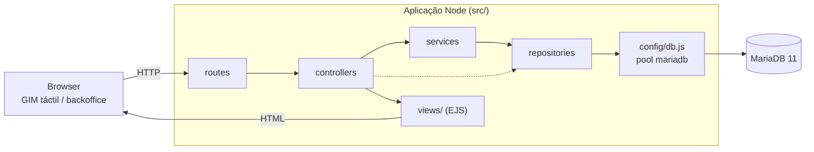
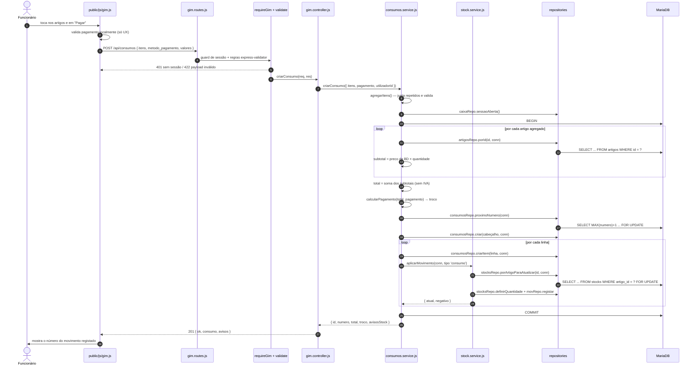

# Arquitetura

Documento para quem vai manter ou evoluir o código. Para instalação, utilização e
contratos de API, ver o [README](../README.md).

## Índice

- [Visão geral](#visão-geral)
- [Camadas](#camadas)
- [Responsabilidade de cada pasta](#responsabilidade-de-cada-pasta)
- [Fluxo de um consumo](#fluxo-de-um-consumo)
- [Onde está a lógica de negócio](#onde-está-a-lógica-de-negócio)
- [Convenções e decisões transversais](#convenções-e-decisões-transversais)
- [Onde tocar para adicionar uma funcionalidade](#onde-tocar-para-adicionar-uma-funcionalidade)

---

## Visão geral

Aplicação Express 5 monolítica, renderizada no servidor com EJS, com uma única API JSON
(a Gestão de Movimentos) e o resto em formulários HTML clássicos. Não há bundler, framework de frontend nem
injeção de dependências: o JavaScript do GIM é `public/js/gim.js` em ES5 puro e os módulos
do servidor fazem `require` diretamente uns dos outros.



Regra de dependências: **cada camada só conhece a camada imediatamente abaixo**. A única
exceção deliberada é o controller poder chamar um repositório diretamente quando não há
regra de negócio envolvida (por exemplo, listar categorias para preencher um `<select>`).

---

## Camadas

### 1. `routes/` — desenho da API e validação de entrada

Definem caminho, método, middlewares de autenticação (`requireAuth`, `requireGim`) e as
regras de `express-validator`. **Não contêm lógica.** Após as regras vem sempre o
middleware `validate`, que decide o que fazer com um payload inválido: `422` JSON para
`/api/*`, ou flash + redirect para trás nos formulários.

`routes/index.js` é a raiz: expõe `/`, `/health` e `/ready` e monta os restantes routers.
`routes/admin.routes.js` aplica `requireAuth` a todo o `/admin` com um único `router.use`.

`routes/gim.routes.js` termina com um bloco de **compatibilidade temporária**: as rotas
antigas `/pos`, `/api/pos/artigos` e `/pos/pin` (o ecrã chamava-se POS) respondem `308` a
apontar para os equivalentes em `/gim`. É um andaime de migração para os atalhos já
gravados nos tablets do balcão e pode ser removido quando deixarem de existir. Usa-se
`308` e não `301` porque preserva o método e o corpo do pedido.

### 2. `controllers/` — tradução HTTP ↔ domínio

Leem `req.body`/`req.query`/`req.params`, chamam serviços, e devolvem uma resposta: um
`res.render(...)` com os dados para a view, um `res.json(...)`, ou um `redirect` com uma
flash message. Não fazem SQL nem cálculos de negócio. Não têm `try/catch`: os erros sobem
para o error handler central em `app.js`.

### 3. `services/` — regras de negócio

É aqui que vive tudo o que é "o negócio decide que...": cálculo de pagamento e troco,
agregação do carrinho, aplicação de movimentos de stock, resumo e fecho de caixa, agregação
de relatórios. Os serviços abrem transações (`db.transaction`) quando uma operação tem de
ser atómica e lançam `AppError(mensagem, status)` para erros esperados.

As funções puramente aritméticas são exportadas separadamente (`calcularPagamento`,
`agregarItens`, `calcularSubtotal`, `calcularTotalCarrinho`, `calcularNovaQuantidade`,
`calcularResumo`) precisamente para poderem ser testadas sem base de dados. **Toda a lógica
nova que possa ser pura deve seguir este padrão.**

### 4. `repositories/` — acesso a dados

Um módulo por agregado. Só SQL parametrizado e mapeamento de linhas. Nenhuma decisão de
negócio.

O truque central está em `repositories/base.js`:

```js
const run = (conn) => conn || db;
```

Todas as funções de repositório recebem um `conn` opcional como último argumento. Chamadas
fora de transação usam o pool; chamadas dentro de uma transação recebem a ligação e
participam nela. As funções que dependem obrigatoriamente de transação — as que usam
`FOR UPDATE`, como `consumosRepo.proximoNumero`, `consumosRepo.porIdParaAtualizar` e
`stocksRepo.porArtigoParaAtualizar` — usam `conn.query` diretamente, o que as torna
impossíveis de chamar por engano fora de uma transação.

### 5. `config/db.js` — pool e transações

Cria o pool `mariadb` e expõe `query`, `queryOne`, `transaction`, `testConnection` e
`close`. `transaction(fn)` obtém uma ligação, faz `beginTransaction`, corre `fn(conn)`,
`commit` em sucesso, `rollback` em erro e `release` sempre.

Opções relevantes do pool: `decimalAsNumber`, `bigIntAsNumber` e `insertIdAsNumber` fazem
com que os `DECIMAL(10,2)` e os IDs cheguem como `Number` em vez de string ou `BigInt`, o
que evita conversões espalhadas pelo código.

---

## Responsabilidade de cada pasta

| Caminho | Responsabilidade |
| --- | --- |
| `src/app.js` | Monta a aplicação Express: view engine, parsers, estáticos, sessão, middlewares globais, routers, 404 e error handler central. Exporta a app sem a pôr à escuta (é o que permite os testes com supertest). |
| `src/server.js` | Ponto de entrada. Testa a ligação à base de dados (sem falhar o arranque), põe a app à escuta e trata de `SIGTERM`/`SIGINT` com encerramento limpo. |
| `src/config/env.js` | Única fonte de configuração. Lê o `.env` via dotenv, converte tipos, aplica defaults e impõe `SESSION_SECRET` em produção. **Nenhum outro módulo lê `process.env`** (exceto `db/seed.js`, para as variáveis `SEED_ADMIN_*`). |
| `src/config/db.js` | Pool MariaDB, helpers de query e transação. |
| `src/middleware/auth.js` | Guards (`requireAuth`, `requireAdmin`, `requireGim`), `locals` (expõe utilizador, flash e `currentPath` às views) e `setFlash`. Distingue pedidos de API (responde JSON) de pedidos de página (redireciona). |
| `src/middleware/validate.js` | Handler central do `express-validator`. |
| `src/middleware/upload.js` | Configuração do multer: destino, nome de ficheiro aleatório, filtro de MIME, limite de tamanho e tradução de erros do multer para mensagens de negócio. |
| `src/middleware/layout.js` | Suporte a layout para EJS sem dependências extra: renderiza a view para string e injeta-a em `views/layouts/main.ejs`. `layout: false` salta o layout (usado no talão). |
| `src/routes/` | Definição das rotas e validação de entrada. |
| `src/controllers/` | Tradução entre HTTP e domínio. |
| `src/services/` | Regras de negócio e transações. |
| `src/repositories/` | SQL parametrizado. |
| `src/utils.js` | Helpers puros partilhados: `round2` (dinheiro), `eur`, `hojeISO`, `diasAtrasISO`, `dataHoraPT`, `boolCampo`. |
| `views/` | Templates EJS. `layouts/main.ejs` é o esqueleto; `partials/` tem navbar, flash e footer; as restantes pastas espelham as áreas funcionais. |
| `public/` | Assets servidos como estáticos: `css/`, `js/` (incluindo `gim.js`) e `uploads/` (imagens de artigos). |
| `db/` | `schema.sql` (fonte de verdade do modelo), `apply-schema.js` e `seed.js`. |
| `tests/` | `unit/` (funções puras), `integration/` (HTTP com base de dados falsa), `helpers/fakeDb.js`, `e2e/` (plano, ainda por executar). |

### Assets por página

`views/layouts/main.ejs` aceita três locals opcionais, sempre definidos pelo controller e
**nunca a partir de input do utilizador**:

- `estilos` — array de hrefs de CSS extra (ex.: `['/css/gim.css']`);
- `scripts` — array de srcs de JS extra, carregados com `defer`;
- `bodyClass` — classe aplicada ao `<body>` (ex.: `gim-body`).

Existe ainda `layoutSemNav: true` para páginas que não devem mostrar a navbar nem o
rodapé (login, GIM).

---

## Fluxo de um consumo

Do toque no ecrã até ao commit da transação.



### Pontos a reter

1. **A validação do browser é só conforto.** `gim.js` calcula troco e bloqueia o botão para
   dar feedback imediato, mas a decisão real é toda do servidor. Um pedido forjado com
   preços ou totais inventados é ignorado: só `artigo_id` e `quantidade` são lidos.
2. **Tudo o que é escrito está numa transação.** Cabeçalho, itens, atualização de stock e
   movimentos de stock partilham a mesma ligação. Qualquer erro no meio faz `rollback` — não
   fica um consumo sem itens nem stock descontado sem consumo.
3. **`FOR UPDATE` em dois sítios.** Na numeração (evita números duplicados com postos
   concorrentes) e na linha de stock de cada artigo (evita perder decrementos simultâneos).
4. **A caixa aberta é lida antes da transação** e apenas para preencher `sessao_caixa_id`.
   Não haver caixa aberta não impede o consumo: o campo fica a `NULL`.
5. **Stock negativo não é erro.** `aplicarMovimento` devolve `{ negativo: true }`, o serviço
   acumula uma mensagem em `avisosStock` e o consumo segue para commit. Ver a decisão de design
   no [README](../README.md#decisões-de-design).

### Anulação de um consumo

`POST /admin/consumos/:id/anular` → `consumos.service.anularConsumo`, também numa transação:
bloqueia o consumo com `SELECT ... FOR UPDATE` (evita anulação dupla), rejeita se já estiver
anulada (`409`), cria um movimento de `entrada` por cada item com `artigo_id` ainda
existente e marca o consumo como `anulada`. O consumo nunca é apagado.

---

## Onde está a lógica de negócio

| Regra | Ficheiro | Função |
| --- | --- | --- |
| Agregação e validação do carrinho | `services/consumos.service.js` | `agregarItens` |
| Subtotal e total (sem IVA) | `services/consumos.service.js` | `calcularSubtotal`, `calcularTotalCarrinho` |
| Método de pagamento e troco | `services/consumos.service.js` | `calcularPagamento` |
| Transação do consumo | `services/consumos.service.js` | `criarConsumo` |
| Anulação e reposição de stock | `services/consumos.service.js` | `anularConsumo` |
| Efeito de um movimento no stock | `services/stock.service.js` | `calcularNovaQuantidade` |
| Stock negativo permitido | `services/stock.service.js` | `aplicarMovimento`, `isStockNegativo` |
| Alerta de stock baixo | `services/stock.service.js` | `isStockBaixo` |
| Dinheiro esperado em caixa | `services/caixa.service.js` | `calcularResumo` |
| Uma só caixa aberta | `services/caixa.service.js` | `abrir` |
| Fecho e diferença | `services/caixa.service.js` | `fechar` |
| Autenticação e comparação em tempo constante | `services/auth.service.js` | `autenticar`, `autenticarPorPin` |
| Agregações de relatórios | `services/relatorios.service.js` + `repositories/relatorios.repo.js` | `periodo`, `dashboard` |
| Soft-delete de artigos | `controllers/artigos.controller.js` | `remover` (usa `artigosRepo.temConsumos`) |
| Soft-delete de categorias | `controllers/categorias.controller.js` | `remover` (usa `categoriasRepo.contarArtigos`) |
| Arredondamento monetário | `src/utils.js` | `round2` |

> As duas regras de soft-delete vivem hoje no controller por serem decisões simples de
> fluxo. Se ganharem complexidade (por exemplo, uma política de arquivo), o sítio certo
> passa a ser um serviço.

---

## Convenções e decisões transversais

**Tratamento de erros.** Os serviços lançam `AppError(mensagem, status)` para erros
esperados e de mensagem apresentável. O error handler em `app.js` distingue três casos:
`AppError` (usa a mensagem tal como está), `MulterError` (`400`, mensagem genérica de
upload) e erros de driver com código `ER_*` (`500`, "Erro na base de dados", com o detalhe
apenas no log). Pedidos a `/api/*` recebem JSON; os restantes recebem a página de erro. O
stack trace só é exposto fora de `production`.

**Async sem `try/catch` nos controllers.** O Express 5 encaminha automaticamente as
rejeições de handlers `async` para o error handler, pelo que não é preciso `catch` nem
wrappers do tipo `asyncHandler`.

**Dinheiro.** Sempre `DECIMAL(10,2)` na base de dados e `round2` em qualquer soma ou
multiplicação em JavaScript. Nunca comparar valores monetários com `===` sem arredondar;
as comparações de suficiência usam uma margem de `0.001`.

**Datas.** Usar `hojeISO` / `diasAtrasISO` de `utils.js`, nunca `toISOString()` — este
converte para UTC e, em Portugal no horário de verão, atira os consumos da meia-noite para o
dia anterior. Os intervalos nos repositórios são fechados: `de 00:00:00` a `ate 23:59:59`.

**Sem injeção de dependências.** Os repositórios fazem `require('../config/db')`
diretamente. É por isso que `tests/helpers/fakeDb.js` substitui o módulo no `require.cache`
e limpa o resto do cache de `src/` antes de carregar a app. Se alguma vez se introduzir DI,
esse helper deixa de ser necessário — mas até lá, **manter o `require` direto**, sob pena
de partir os testes de integração.

**Nomes em português.** Tabelas, colunas, funções e variáveis estão em português, sem
acentos no código (os acentos aparecem apenas em texto visível ao utilizador e na
documentação). Manter esta convenção.

---

## Onde tocar para adicionar uma funcionalidade

### Exemplo concreto: adicionar o campo `codigo_barras` a um artigo

Um campo de texto opcional, único, para permitir procurar um artigo por leitor de códigos
de barras. Ordem de trabalho:

**1. Base de dados — [`db/schema.sql`](../db/schema.sql)**

Acrescentar a coluna à definição de `artigos` (para instalações novas):

```sql
codigo_barras VARCHAR(32) NULL,
...
UNIQUE KEY uq_artigos_codigo_barras (codigo_barras),
```

Como `apply-schema.js` só faz `CREATE TABLE IF NOT EXISTS`, uma base de dados já existente
não é alterada. Para instalações existentes é preciso um `ALTER TABLE` manual — ou
introduzir um mecanismo de migrações, se estas alterações passarem a ser frequentes:

```sql
ALTER TABLE artigos
  ADD COLUMN codigo_barras VARCHAR(32) NULL AFTER nome,
  ADD UNIQUE KEY uq_artigos_codigo_barras (codigo_barras);
```

**2. Repositório — [`src/repositories/artigos.repo.js`](../src/repositories/artigos.repo.js)**

- Acrescentar `a.codigo_barras` ao `SELECT_BASE`.
- Incluir o campo no `INSERT` de `criar` e no `UPDATE` de `atualizar`.
- Se for preciso procurar por código, acrescentar uma função nova (ex.: `porCodigoBarras`),
  sempre com `?` parametrizado.

**3. Rota e validação — [`src/routes/artigos.routes.js`](../src/routes/artigos.routes.js)**

Acrescentar a regra ao array `regras` (partilhado entre criar e atualizar):

```js
body('codigo_barras').optional({ checkFalsy: true }).trim().isLength({ max: 32 })
  .withMessage('Codigo de barras invalido.'),
```

**4. Controller — [`src/controllers/artigos.controller.js`](../src/controllers/artigos.controller.js)**

Ler `codigo_barras` de `req.body` em `criar` e `atualizar` e passá-lo ao repositório,
normalizando o vazio para `null` (uma string vazia partiria o índice único ao segundo
artigo sem código).

**5. Vista — [`views/admin/artigos/form.ejs`](../views/admin/artigos/form.ejs)**

Acrescentar o `<input name="codigo_barras" value="<%= artigo ? artigo.codigo_barras || '' : '' %>">`.
Se o campo também deve ser visível na listagem, acrescentar a coluna em `views/admin/artigos/index.ejs`.

**6. GIM (só se o campo for usado no consumo)**

- [`src/controllers/gim.controller.js`](../src/controllers/gim.controller.js): incluir o
  campo no objeto devolvido por `catalogo`. **Só expor o que o GIM precisa** — o catálogo é
  público para qualquer sessão iniciada.
- [`public/js/gim.js`](../public/js/gim.js): usar o campo na pesquisa/filtragem.

**7. Testes**

- Se a alteração introduzir uma função pura (por exemplo, normalizar ou validar o código),
  criar um teste em `tests/unit/`.
- Se alterar o payload ou a resposta de uma rota, atualizar ou acrescentar um teste em
  `tests/integration/`, acrescentando os handlers necessários ao `fakeDb`.

**8. Documentação**

Atualizar a secção *Modelo de dados* do [README](../README.md#modelo-de-dados) — texto da
tabela `artigos` e o `erDiagram` — e, se o contrato da API mudar, a secção
*Contrato `POST /api/consumos`*.

### Padrão geral

| Tipo de alteração | Ficheiros a tocar, por ordem |
| --- | --- |
| Novo campo numa entidade | `db/schema.sql` → repositório → rota (validação) → controller → view → testes → README |
| Nova regra de negócio | Serviço (de preferência como função pura exportada) → teste unitário → controller, se mudar a resposta |
| Novo ecrã de backoffice | View → controller → rota (montada em `admin.routes.js`) → link em `views/partials/navbar.ejs` |
| Novo endpoint JSON | Rota em `/api/*` com `requireGim`/`requireAuth` e validação → controller → serviço → contrato no README |
| Nova configuração | `src/config/env.js` (com default) → `.env.example` → tabela de variáveis no README |
| Nova query/relatório | Repositório (SQL parametrizado) → serviço (agregação) → controller → view |

### Antes de dar por concluído

- [ ] `npm test` passa.
- [ ] Nenhum SQL construído por concatenação com valores de utilizador.
- [ ] Nenhum `process.env` fora de `src/config/env.js` (exceto `db/seed.js`).
- [ ] Valores monetários passados por `round2`.
- [ ] Se houver escritas relacionadas, estão na mesma transação.
- [ ] Nenhuma noção de IVA introduzida: o preço do artigo continua a ser o valor final.
- [ ] README atualizado se mudaram rotas, contratos, schema ou configuração.
